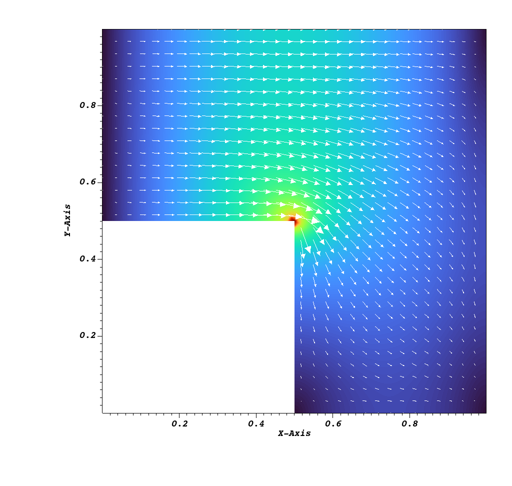
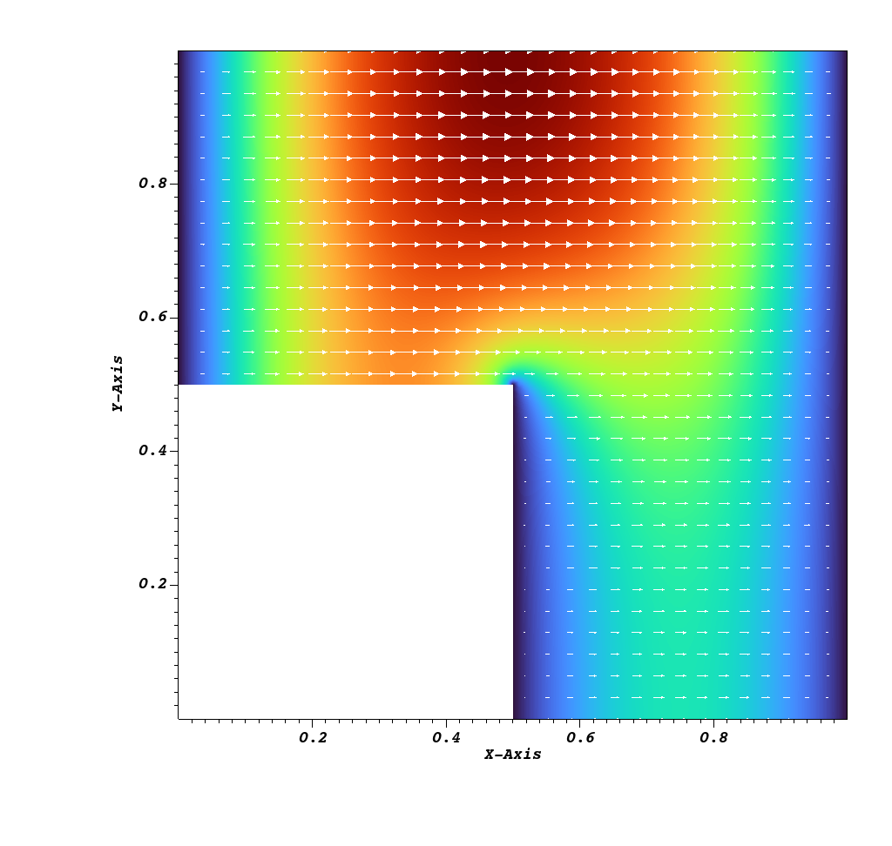

# k=1 Hodge Laplace problem in 2d

Make the mesh

```shell
python mesh.py
```

See the mesh

```shell
gmsh gamma.msh
```

Run primal formulation

```shell
python primal.py
visit -o sol.pvd
```

and plot vectors of `u`.

Run mixed formulation

```shell
python mixed.py
visit -o sol.pvd
```

and plot vectors of `u`.




Compare with Fig. 5.1 of Arnold.
